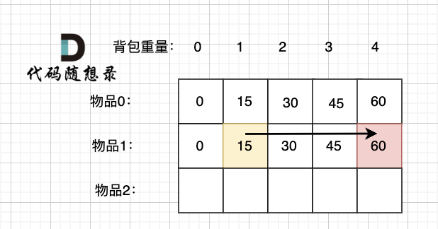

# 完全背包
有 n 种物品 背包容量为 c 可以存放的最大的物品价值
这个时候 背包应当是正序遍历 在将第一种物品装满之后的价值，然后减少第一种物品的数量 加入其他物品，也就是遍历 然后得出最大价值
## 二维数组
```c++
class Solution {
public:
    int coinChange(vector<int>& coins, int amount) {
        int n = coins.size();
        vector dp(n + 1, vector<int>(amount + 1, INT_MAX / 2));
        dp[0][0] = 0;

        for (int i = 0; i < n; i++) {
            for (int c = 0; c <= amount; c++) {
                if (c < coins[i]) {
                    dp[i + 1][c] = dp[i][c];
                } else {
                    // 这里和 01背包 不一样
                    // dp[i + 1][c] = max(dp[i][c] // 不选当前的物品, dp[i + 1][c - weight[i]] + value[i])
                    // 这上面这个公式是重中之重
                    dp[i + 1][c] = min(dp[i][c], dp[i + 1][c - coins[i]] + 1);
                }
            }
        }
        int ans = dp[n][amount];
        return ans < INT_MAX / 2 ? ans : -1; 
    }
};
```

上面这一张图片很好的解释了 完全背包的遍历过程
## 一维数组
1. dp数组的含义 
dp[i] 代表总金额为 i 时的最少的硬币数量
2. 确定递推公式
dp[i] = min(dp[i], dp[i - range(coins)] + 1)
3. dp数组如何初始化
dp[0] = 0 
为什么？
当金额为 0 时 只需要 0 个硬币
4. 确定遍历顺序 
从第二点分析就可以看出 遍历硬币要放在内层循环
5. 举例推导
这里一定要和上面那一幅图相结合

```c++
class Solution {
public:
    int coinChange(vector<int>& coins, int amount) {
        vector<int> dp(amount + 1, INT_MAX / 2);
        dp[0] = 0;
        for (int i = 0; i <= amount; i++) {
            for (int j = 0; j < coins.size(); j++) {
                if (i >= coins[j]) {
                    dp[i] = min(dp[i], dp[i - coins[j]] + 1);
                }
            }
        }
        int res = dp[amount];
        return res < INT_MAX / 2 ? res : -1;
    }
};
```