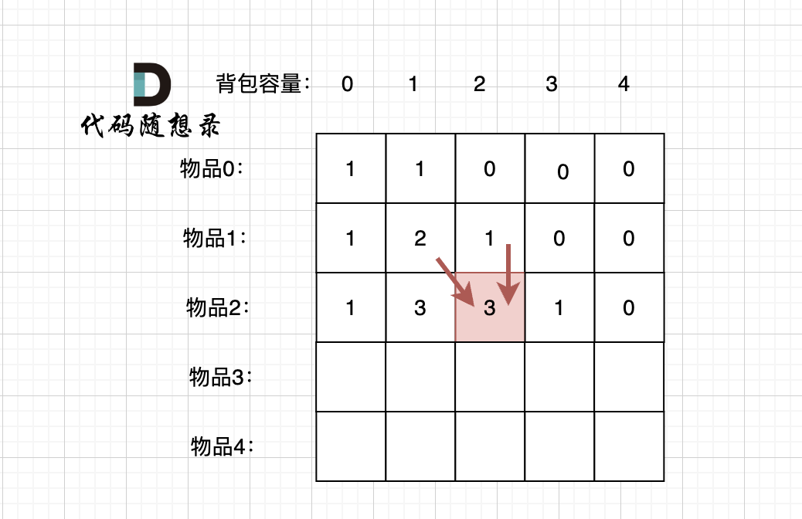

# 回溯 + 数学推导
设正数为 p 负数为 q 
有 p + q == sum 
p - q == target
那么 p == (sum + target) / 2 
q == (sum - target) / 2
将正数或者是负数作为选择对象是相同的
如果 target >= 0
choose q == (sum - target) / 2 as the standered
if target < 0
choose p == (sum - |target|) / 2 as the standerd
so the problem translate to selecting serval numbers such that (sum - |target|) / 2 equals this number
## three questions for reflection
before delving into the retrospective, we need to clarify the meaning of arrays
i represents the index of the object, c represents the capacity of an object
1. current operation
选或者不选当前的物品
如果选，背包中的容量减去当前物品的重量
如果不选，剩余容量不变
2. sub_problem
剩余容量为 c 时，所能得到的最大价值
3. next sub-problem
如果选，那么在剩余容量为 c - nums[i] ，得到的最大价值
如果不选，剩余容量在 c ，得到的最大价值

上面这张图很好的诠释了选和不选的问题
```c++
class Solution {
public:
    int findTargetSumWays(vector<int>& nums, int target) {
        int s = reduce(nums.begin(), nums.end()) - abs(target);

        if (s < 0 || s % 2 != 0) {
            return 0;
        }
        int m = s / 2;
        int n = nums.size();
        vector f(n + 1, vector<int>(m + 1));

        f[0][0] = 1;
        for (int i = 0; i < n; i++) {
            for (int c = 0; c <= m; c++) {
                if (c < nums[i]) {
                    f[i + 1][c] = f[i][c];
                } else {
                    f[i + 1][c] = f[i][c] + f[i][c - nums[i]];
                }
            }
        }
        return f[n][m];
    }
};
```
哎呦我操，一做题就感觉干什么都好有意思，哎我操
# 一维数组
如果我们只用一个数组是不是可以完成任务呢？
这里看灵神的讲解并不是很直观，我们还是看上面那一张图片
在更新这一格的时候，如果我们可以做到步破坏上一行的数据，我们就可以更新到数据
那么我们这个时候结合灵神的视频，我们会发现，如果从前往后的话，我们是一定会破坏数组的
如果这个时候从后往前，结合上面那一张图和灵神的视频，我们会发现，这样刚好可以做到不破坏上一行的数据的同时，并且做到更新
```c++
class Solution {
public:
    int findTargetSumWays(vector<int>& nums, int target) {
        int s = reduce(nums.begin(), nums.end()) - abs(target);

        if (s < 0 || s % 2 != 0) {
            return 0;
        }

        int m = s / 2;
        vector<int> f(m + 1);
        f[0] = 1;

        for (int x : nums) {
            for (int c = m; c >= x; c--) {
                f[c] += f[c - x];
            }
        }

        return f[m];
    }
};
```